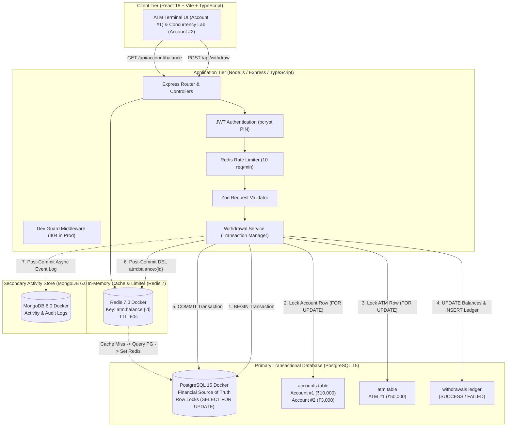
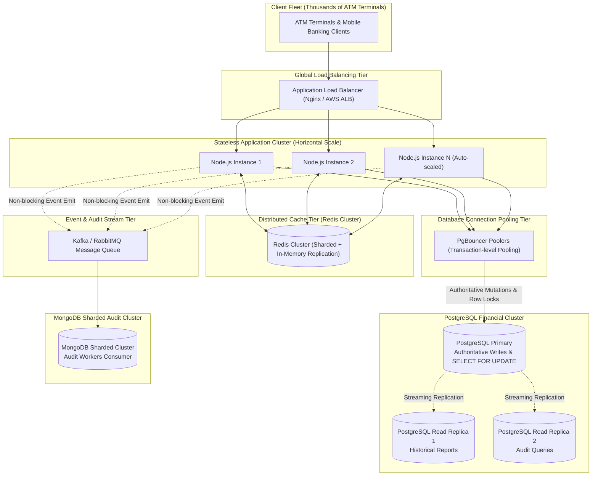

# System Design Document: Concurrency-Safe ATM Simulation

---

## 1. Problem Understanding & Concurrency Challenge

An Automated Teller Machine (ATM) executes mission-critical financial mutations where account balances and physical vault cash must remain strictly consistent and never become negative under concurrent traffic.

### The Race Condition (Double-Spending)
Consider an account with **₹3,000.00** balance receiving two simultaneous withdrawal requests of **₹2,000.00** (Request A and Request B) within the same millisecond:
- **Without Concurrency Safety**: Both requests read ₹3,000, both pass the balance threshold check (`3000 >= 2000`), and both deduct ₹2,000. The final balance becomes **₹-1,000.00** (an illegal overdraft and severe financial bug).
- **Our ACID Solution**: PostgreSQL **Row-Level Locking** via `SELECT ... FOR UPDATE` serializes transaction execution at the database engine level. Request A locks the row, validates, deducts ₹2,000, and commits (leaving ₹1,000). Request B unblocks, reads the committed ₹1,000, fails validation (`1000 < 2000`), inserts a permanent `FAILED` withdrawal ledger record in PostgreSQL with reason `INSUFFICIENT_BALANCE`, commits the ledger transaction, and returns `409 Conflict (INSUFFICIENT_BALANCE)`. The failed attempt remains permanently recorded in PostgreSQL without altering account balance or ATM cash. Final balance is strictly **₹1,000.00**.

---

## 2. Architectural Responsibilities & Storage Separation

### Why PostgreSQL 15 is the Financial Source of Truth
- **ACID Compliance**: PostgreSQL provides Atomicity, Consistency, Isolation, and Durability guarantees.
- **Pessimistic Row-Level Locking**: Native `SELECT ... FOR UPDATE` creates deterministic mutual exclusion without relying on single-threaded application mutexes.
- **Integrity Constraints**: Database-level `CHECK (balance >= 0)` and `CHECK (available_cash >= 0)` guarantee that invalid states cannot be written even in edge-case anomalies.
- **Complete Financial Ledger**: Every withdrawal attempt (both `SUCCESS` and `FAILED`) is permanently written to PostgreSQL `withdrawals` table for authoritative financial accounting.

### Why MongoDB 6.0 is Used for Audit / Activity Logging
- **Append-Only Activity Stream**: MongoDB captures unstructured event streams, debug metadata, IP origins, and user session telemetry.
- **Decoupled Failure Isolation**: Auditing is asynchronous and non-blocking. If MongoDB encounters network latency or downtime, the primary PostgreSQL financial transactions remain completely operational and unhindered.
- **No Authorization Authority**: MongoDB is never queried to determine if a withdrawal should be allowed or what an account balance is.

### Why Redis 7 is Used for Caching and Rate Limiting
- **Read Latency Reduction**: Balance inquiries (`GET /api/account/balance`) check Redis first (`atm:balance:<accountId>`), returning in sub-5ms without burdening the PostgreSQL connection pool.
- **API Protection**: Sliding rate limiter (10 requests/minute on `POST /api/withdraw`) prevents brute-force denial of service or abuse.
- **Cache-Aside with Invalidation**: Redis is an optimization layer; balances are invalidated immediately upon PostgreSQL transaction commit (`DEL atm:balance:<accountId>`).

---

## 3. Two-Account Architecture & State Isolation

To ensure that real concurrent database testing does not disrupt normal user banking operations, the system implements an isolated two-account architecture in PostgreSQL:

| Account Property | Account #1 (Normal User Account) | Account #2 (Concurrency Sandbox) |
|---|---|---|
| **Account Number** | `10000001` | `10000002` |
| **Holder Name** | `Demo User` | `Concurrency Sandbox` |
| **Standard Balance** | **₹10,000.00** | **₹3,000.00** |
| **Purpose** | Normal ATM user interactions (log in, balance checks, ₹1,000 withdrawals, transaction history) | Dedicated testing sandbox for live concurrency validation |
| **User Access** | User-facing authentication via PIN (`1234`) | Internal development/demo account only; no user login |
| **Isolation Rule** | Normal withdrawals modify Account #1 balance (e.g. ₹10,000 $\rightarrow$ ₹9,000) | Concurrency lab runs real PostgreSQL transactions against Account #2 |

### Real Concurrency Execution on Sandbox Account #2
The Concurrency Safety Lab executes real PostgreSQL transactions against Account #2:
1. Resets Account #2 balance to ₹3,000.00 in PostgreSQL.
2. Dispatches two simultaneous real `WithdrawalService.withdraw` transactions of ₹2,000.00 each against Account #2.
3. PostgreSQL row-level locks (`SELECT ... FOR UPDATE`) serialize execution:
   - **Request A**: `SUCCESS` (HTTP 200) $\rightarrow$ Deducts ₹2,000.00.
   - **Request B**: `FAILED` (HTTP 409 `INSUFFICIENT_BALANCE`) $\rightarrow$ Rejection ledger entry recorded.
4. **Final Sandbox Balance**: Strictly **₹1,000.00**.
5. **Account #1 Isolation**: Account #1's balance remains strictly untouched (e.g. ₹9,000.00).

---

## 4. Reset Demo State Semantics

The `POST /api/dev/reset-seed` endpoint provides an operational mechanism to restore the system to baseline demonstration states:

### State Restorations
- **Account #1 (Demo User)**: Restored to **₹10,000.00**.
- **Account #2 (Concurrency Sandbox)**: Restored to **₹3,000.00**.
- **ATM #1 (Vault Reservoir)**: Restored to **₹50,000.00**.
- **Redis Cache Invalidation**: Deletes `atm:balance:1` and `atm:balance:2` so subsequent balance checks query fresh PostgreSQL values.

### Immutable Financial History Preservation
Reset Demo State **does NOT delete or truncate**:
- `withdrawals` table records (both `SUCCESS` and `FAILED` attempts remain permanently recorded).
- MongoDB `activitylogs` collection (all audit history remains intact).

Financial accounting compliance requires that past transaction attempts remain an immutable historical audit trail.

### Frontend Form State Reset
Upon receiving confirmation from `POST /api/dev/reset-seed`, the frontend automatically resets temporary form state:
- Clears the custom withdrawal input field (`amount = ''`).
- Deselects any pre-selected quick-denomination buttons.
- Removes prior success or error notification messages.

---

## 5. High-Level Architecture (HLD)



---

## 6. PostgreSQL Schema & Database Constraints

```sql
-- 1. Accounts Table (Financial Source of Truth)
CREATE TABLE accounts (
    id SERIAL PRIMARY KEY,
    account_number VARCHAR(20) UNIQUE NOT NULL,
    holder_name VARCHAR(100) NOT NULL,
    pin_hash VARCHAR(255) NOT NULL,
    balance NUMERIC(12, 2) NOT NULL DEFAULT 0.00 CHECK (balance >= 0),
    created_at TIMESTAMP WITH TIME ZONE DEFAULT CURRENT_TIMESTAMP,
    updated_at TIMESTAMP WITH TIME ZONE DEFAULT CURRENT_TIMESTAMP
);

-- 2. ATM Machine Vault Table
CREATE TABLE atm (
    id SERIAL PRIMARY KEY,
    available_cash NUMERIC(12, 2) NOT NULL DEFAULT 0.00 CHECK (available_cash >= 0),
    updated_at TIMESTAMP WITH TIME ZONE DEFAULT CURRENT_TIMESTAMP
);

-- 3. Withdrawals Ledger Table (Records all SUCCESS and FAILED attempts)
CREATE TABLE withdrawals (
    id SERIAL PRIMARY KEY,
    account_id INTEGER NOT NULL REFERENCES accounts(id) ON DELETE CASCADE,
    atm_id INTEGER NOT NULL REFERENCES atm(id) ON DELETE CASCADE,
    amount NUMERIC(12, 2) NOT NULL CHECK (amount > 0),
    status VARCHAR(20) NOT NULL, -- 'SUCCESS' or 'FAILED'
    failure_reason VARCHAR(255),
    balance_before NUMERIC(12, 2),
    balance_after NUMERIC(12, 2),
    created_at TIMESTAMP WITH TIME ZONE DEFAULT CURRENT_TIMESTAMP
);

-- Performance Indexes
CREATE INDEX idx_accounts_account_number ON accounts(account_number);
CREATE INDEX idx_withdrawals_account_created ON withdrawals(account_id, created_at DESC);
CREATE INDEX idx_withdrawals_status ON withdrawals(status);
```

---

## 7. MongoDB Audit Schema

### Collection: `activitylogs`
```typescript
{
  _id: ObjectId,
  eventType: "WITHDRAWAL_SUCCESS" | "WITHDRAWAL_FAILED" | "BALANCE_CHECK" | "LOGIN",
  accountId: Number,
  withdrawalId?: Number,
  amount?: Number,
  status: "SUCCESS" | "FAILED" | "INFO",
  metadata: {
    balanceBefore?: Number,
    balanceAfter?: Number,
    atmId?: Number,
    atmCashAfter?: Number,
    reason?: String,
    source?: String
  },
  timestamp: Date
}
```

---

## 8. Concurrency Strategy & Row-Level Locking Analysis

### Why Lock Both Account and ATM Rows?
- **Account Row Lock**: Protects the user's funds from simultaneous withdrawals across different channels (multiple ATMs, online banking, concurrent API calls).
- **ATM Row Lock**: Protects the physical vault inventory from being overdrawn if multiple users or automated tests hit the same physical machine concurrently.

### Strict Deterministic Lock Ordering
To prevent **Deadlocks**, all transactions acquire locks in the exact same sequence:
1. **First**: Lock `accounts` row (`SELECT ... FROM accounts WHERE id = $1 FOR UPDATE`)
2. **Second**: Lock `atm` row (`SELECT ... FROM atm WHERE id = $2 FOR UPDATE`)

### Transaction Execution Steps
```
1. BEGIN
2. SELECT balance FROM accounts WHERE id = $accountId FOR UPDATE;
3. SELECT available_cash FROM atm WHERE id = $atmId FOR UPDATE;
4. If balance < amount:
     INSERT INTO withdrawals (status='FAILED', failure_reason='INSUFFICIENT_BALANCE', balance_before=b, balance_after=b);
     COMMIT;
     Return 409 Conflict (INSUFFICIENT_BALANCE);
5. If available_cash < amount:
     INSERT INTO withdrawals (status='FAILED', failure_reason='ATM_CASH_UNAVAILABLE', balance_before=b, balance_after=b);
     COMMIT;
     Return 409 Conflict (ATM_CASH_UNAVAILABLE);
6. UPDATE accounts SET balance = balance - amount WHERE id = $accountId;
7. UPDATE atm SET available_cash = available_cash - amount WHERE id = $atmId;
8. INSERT INTO withdrawals (status='SUCCESS', failure_reason=NULL, balance_before=b, balance_after=b-amount);
9. COMMIT;
10. Post-Commit: DEL atm:balance:$accountId (Redis invalidation)
11. Post-Commit: Emit async event to MongoDB ActivityLog
12. Return 200 OK
```

---

## 9. Fault Tolerance & Failure Recovery

### What Happens If Redis Fails?
- **Balance Inquiries**: On Redis connection error, the `CacheService` catches the exception and falls back to querying PostgreSQL directly. Responses are served with `isCached: false`.
- **Rate Limiter**: The rate limiter attempts Redis `INCR`. If Redis is offline, it fails open, ensuring authenticated users can still perform vital banking withdrawals without service interruption.
- **Financial State Protection**: Redis is strictly a read cache; balance mutations only occur inside PostgreSQL ACID transactions. Redis failure can never cause balance discrepancies or corrupted financial records.

### What Happens If MongoDB Fails?
- **Audit Isolation**: The `AuditService.log()` function is wrapped in non-blocking asynchronous execution with internal `try/catch`.
- If MongoDB goes offline or rejects writes, an error is logged to stdout, but the PostgreSQL financial transaction is **already committed** and **never rolled back**.

---

## 10. Security Strategy

1. **Password / PIN Hashing**: Salted and hashed using `bcrypt` (10 rounds). Plaintext PINs are never stored, transmitted in logs, or returned in API responses.
2. **Stateless JWT Tokens**: Signed with HMAC-SHA256 and verified via `authMiddleware`.
3. **Development Endpoint Gating (`devGuard`)**:
   - `POST /api/dev/reset-seed` and `POST /api/dev/concurrency-test` strictly return `404 Not Found` in production (`NODE_ENV !== 'development' && DEV_TOOLS_ENABLED !== 'true'`).
4. **SQL Injection Defense**: Strict parameterization (`$1, $2, ...`) on all queries.
5. **Request Validation**: Zod schema validation enforces positive numeric bounds and 2-decimal currency precision.

---

## 11. API Specification

| Method | Path | Auth | Dev Only | Description |
|---|---|---|---|---|
| `POST` | `/api/auth/login` | No | No | Authenticate account number and PIN (Account #1) |
| `GET` | `/api/account/balance` | Yes | No | Get live balance (Redis cache-aside with 60s TTL) |
| `POST` | `/api/withdraw` | Yes | No | Concurrency-safe cash withdrawal (Row-locked) |
| `GET` | `/api/transactions` | Yes | No | Fetch bounded account withdrawal history |
| `GET` | `/api/atm/status` | No | No | Get ATM vault cash inventory |
| `POST` | `/api/dev/reset-seed` | No | Yes (404 in Prod) | Reset Account #1 (₹10k), Account #2 (₹3k), ATM (₹50k) |
| `POST` | `/api/dev/concurrency-test` | No | Yes (404 in Prod) | Run parallel 2x ₹2,000 withdrawals on Account #2 |
| `GET` | `/api/dev/audit-logs` | No | Yes (404 in Prod) | Query MongoDB activity logs collection |
| `GET` | `/health` | No | No | Server health check endpoint |

---

## 12. 100x Horizontal Scalability Strategy (Architectural Roadmap)

This section details how the ATM simulation architecture can scale to support approximately **100x current traffic** (from tens of requests/sec to thousands of concurrent withdrawal transactions/sec).

> **Important**: This is an architectural scaling roadmap. Components described below represent the design strategy for production scale-out and are distinguished from the currently deployed single-node Docker setup.

### Current Baseline Architecture
- **Application Tier**: Stateless Node.js / Express application instances.
- **Database Tier**: Single primary PostgreSQL 15 instance managing all financial mutations and transactions.
- **Cache Tier**: Single Redis 7 instance for balance caching and rate limiting.
- **Audit Tier**: Single MongoDB 6 instance for non-blocking activity logging.
- **Connection Management**: Direct `pg.Pool` connection pooling.

### 100x Scalability Evolution Plan



### Key Scaling Pillars

#### 1. Stateless Application Tier Horizontal Scaling
- Because Express instances maintain **zero in-memory session state** (authentication is handled via stateless JWTs and caching is centralized in Redis), the backend cluster can scale horizontally behind an Application Load Balancer (ALB / Nginx) using CPU/request-based autoscaling groups.

#### 2. PgBouncer Connection Pool Management
- At 100x traffic, hundreds of Node.js worker threads connecting directly to PostgreSQL would exhaust database connection limits (`max_connections`).
- Placing **PgBouncer** in front of PostgreSQL using **Transaction-level pooling** allows thousands of client requests to share a compact pool of dedicated backend connections (e.g. 50-100 real connections), drastically reducing server memory overhead and context switching.

#### 3. Strict Financial Consistency Rule (Primary Database Authority)
- **Authoritative Balance Verification & Cash Deductions MUST NEVER Be Routed to Read Replicas**:
  Due to asynchronous replication lag in read replicas, balance checks prior to withdrawals could read stale data, reintroducing race conditions and overdraft risks.
- **Strict Rule**: All cash withdrawal transactions (`POST /api/withdraw`) must continue to execute exclusively on the **Primary PostgreSQL database** within an ACID transaction using `SELECT ... FOR UPDATE`.
- **Read Replicas**: Read replicas are utilized strictly for read-heavy operations where point-in-time eventual consistency is acceptable (e.g. exporting yearly statements or administrative audit dashboards).

#### 4. PostgreSQL Table Partitioning for Transaction History
- At 100x transaction volume, the `withdrawals` ledger will grow by millions of rows daily.
- Implementing **Declarative Range Partitioning** on the `withdrawals` table by month/quarter (`created_at`) ensures that index lookups for recent transactions remain fast and index working sets fit entirely into RAM.

#### 5. Sharding by Account ID (Multi-Database Scale)
- If write volume exceeds the capacity of a single high-memory PostgreSQL primary, the database can be partitioned horizontally using **Account-based Sharding** (e.g. `Account ID % N` or consistent hashing via Citus / Vitess-style architecture).
- Because withdrawal transactions lock only an individual account and an individual ATM, cross-shard distributed transactions are unnecessary, preserving single-shard ACID performance.

#### 6. Redis Cluster for Distributed Caching & Rate Limiting
- Upgrading to **Redis Cluster with master-replica sharding** provides high availability, automatic failover, and multi-gigabyte in-memory caching capacity.
- Rate limiting keys (`ratelimit:withdraw:<ip>`) and balance cache keys (`atm:balance:<id>`) hash naturally across shard slots.

#### 7. Message Queue Decoupling for Audit Logging (Kafka / RabbitMQ)
- Instead of Express instances writing directly to MongoDB over HTTP/TCP, audit events are published to a high-throughput **Kafka** or **RabbitMQ** topic.
- Dedicated background worker services consume the event stream and batch-insert audit records into a sharded MongoDB cluster, isolating the transactional API from any audit store latency spikes.

---

## 13. Architectural Trade-offs

| Trade-off Area | Chosen Strategy | Alternative | Rationale |
|---|---|---|---|
| **Concurrency Control** | Pessimistic Locking (`SELECT FOR UPDATE`) | Optimistic Locking (`version` column) | Pessimistic locking prevents cascading transaction retries under high contention and guarantees deterministic ordering for financial mutations. |
| **Cache Consistency** | Immediate `DEL` Invalidation on Commit | Write-Through Cache Mutation | Invalidation prevents race conditions where an async cache update overwrites with stale data. |
| **Audit Resiliency** | Asynchronous Non-Blocking MongoDB | Synchronous Distributed 2PC | Financial transactions must not block or abort due to secondary audit store latency or unavailability. |
| **Rate Limit Failure** | Fail Open | Fail Closed (Block All Withdrawals) | In banking terminals, availability of cash access is prioritized over auxiliary rate-limit enforcement when cache nodes fail. |
